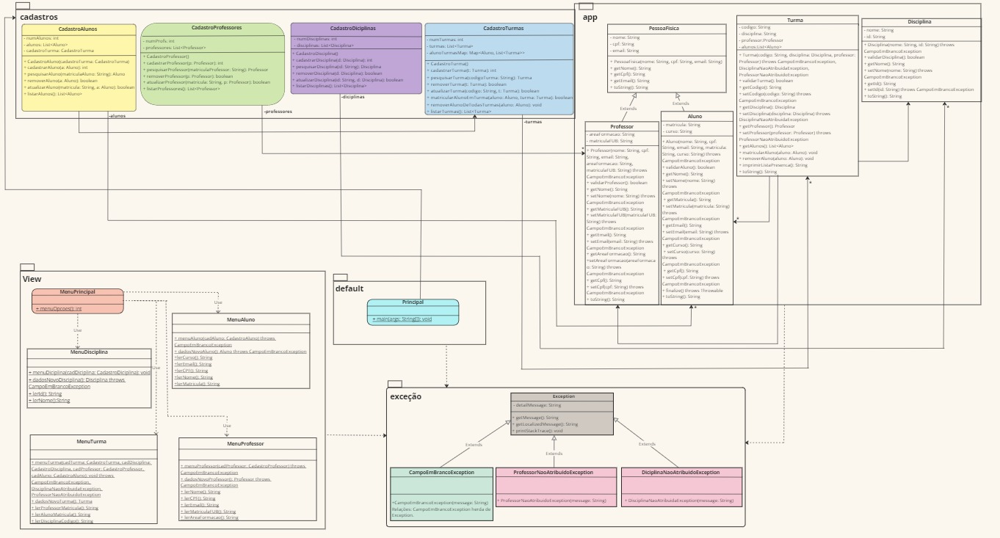

UnB - Universidade de Brasilia  
FGA - Faculdade do Gama  
OO - Orientação por Objetos  
Prof. André Luiz Peron Martins Lanna 

Componentes do Grupo:

Nomes:  
João Marcos Moraes de Andrade nº222006113  
Marjorie Mitzi Cavalcante Rodrigues nº231039140

#### Trabalho Prático de Orientação por Objetos 
---

## Objetivo:  
Cadastrar alunos, disciplinas, turmas e professores. 
Podendo ainda pesquisa, remover, atualizar e listar cada um deles.

## Funcionamento:  
O programa e inicializado a partir de um Menu onde o usuário tem opções de escolhas para executar as tarefas.

O diagrama de classes abaixo representa parte do que já está implementado. 
Link para melhor resolução: https://miro.com/welcomeonboard/RlRLcGFCejhyaFR0RFJvTk5MSklEelhTTk9FWXdJNmtzckJYbjVSRmJjN21wTHQ3VmdFbHdNSTdBVUw2TGlxOHwzNDU4NzY0NTk2MTgzOTExNzI5fDI=?share_link_id=910562466756

## Enunciado:  
O código presente no diretório já realiza o cadastro de todas as funcionalidades tratando as
exceções Campo em Branco, Professor e disciplina não atribuidas dentro da funcionalidade turmas.

## Exemplos:
Exemplos ja cadastrados dentro do programa as turmas t1 e t2 com seus respectivos atributos.
Os dados dos alunos abaixo podem ser matriculados em uma turma.

## Disciplina:
Disciplina("Matemática", "11");
Disciplina("Português", "22");

## Professor:
Professor("Ana", "23467123401", "ana.1@gmail.com", "Engenharia automotiva", "00");
Professor("Carlos", "12345678901", "carlos@gmail.com", "Software", "01");

## Aluno:
Aluno("João", "98765432110", "joaozinhogameplay@gmail.com", "99", "Software");
Aluno("Marjorie", "45667812390", "marjorie@gmail.com", "98", "Aero");

## Turma:
Turma("t1", Matematica, Ana);
Turma("t2", Portugues, Carlos);
